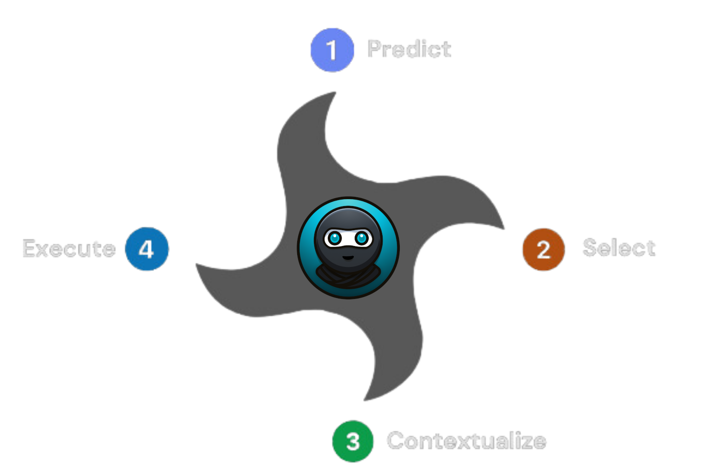

### Agent Personas

| Agent | Expertise |
|-|-|
| 📝[Synthesizer](./packages/agents/src/agents/Synthesizer/index.ts) | "Reads text files, analyzing and gathering data and information from text files, generating summaries and reports, and analyzing text." |
| #️⃣ [Csv Analyst](./packages/agents/src/agents/CsvAnalyst/index.ts) | "Adept at reading CSV files, searching for data, extracting key data points, calculating amounts, and derive insights from CSV files." |
| 🌐 [Researcher](./packages/agents/src/agents/Researcher/index.ts) | "Searching the internet, comprehending details, and finding information." |
| 💻 [Developer](./packages/agents/src/agents/Developer/index.ts) | "Architect and build complex software. specialized in python." |

### Execution Loop

1. **Predict Next Step:** For each iteration of the execution loop, Evo starts by making an informed prediction about what the best-next-step should be.
2. **Select Best Agent:** Based on this prediction, Evo selects a best-fit agent persona.
3. **Contextualize Chat History:** Based on the prediction from step 1, and the agent persona in step 2, the complete chat history is "contextualized" and only the most relevant messages are used for the final evaluation step.
4. **Evaluate and Execute:** A final evaluation step is run to determine what agent function is executed to try and further achieve the user's goal.

These 4 steps run in a loop continuously until it is determined the user's goal has been achieved.

The UI depends on [Supabase Database](https://supabase.com/). In order to run it locally you must have [Docker Desktop](https://docs.docker.com/get-docker/) installed and running.

0. Make sure you've followed installation steps above
1. Go to `cd apps/browser`
2. Run `yarn db:start` - This can take up to ~3 minutes, since it will download all the images needed by supabase
3. Update `.env.local` with the values shown in the output of step 2:
    - `NEXT_PUBLIC_SUPABASE_URL` will have the value of `API URL`
    - `SUPABASE_SERVICE_ROLE_KEY` will have the value of `service_role key`
4. Run the UI with `yarn dev`
